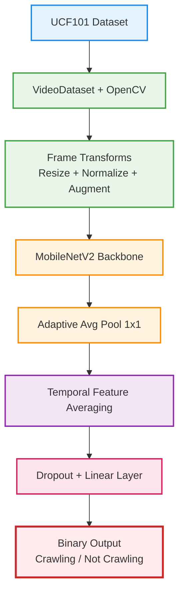
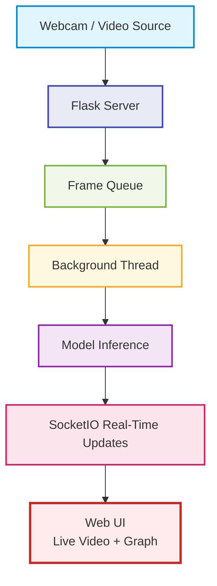

# Real-time video analytics platform for surveillance   (UCF101 Subset)

This project is a real-time deep learning pipeline for **action recognition in video streams**, specifically designed to detect whether a **baby is crawling** or **not crawling** using a custom-trained model on a subset of the UCF101 dataset.

---

## 📌 Project Highlights

- 🔍 **Binary Classification**: Crawl vs. Not Crawl
- 🎥 Real-time video processing using OpenCV and Flask
- 🧠 Custom model built on **MobileNetV2**
- 🔄 Compared against 3 SOTA models: **S6 Model**, **Video Mamba Suite**, and **PRN**
- 📊 Achieved **99% accuracy** on test data
- 🌐 Web-based interface with real-time predictions and dynamic graph updates

---
## 🧠 Model Architecture


## 🚀 Real-Time Deployment Architecture


## 🧠 Model Overview

### Custom Model: `BabyCrawlingModel`

- 🔹 **Feature Extractor**: Pretrained MobileNetV2 (Efficient, low-latency)
- 🔹 **Temporal Modeling**: Averaged frame features passed through a linear layer
- 🔹 **Classifier**: Dropout + Linear for binary prediction
- 🔹 Achieves high speed & accuracy suitable for live deployment

---

## 📂 Dataset

- **Source**: [UCF101 Dataset](https://www.crcv.ucf.edu/data/UCF101.php)
- **Classes Used**: Custom-filtered videos labeled as "crawling" or "not crawling"
- **Loader**: Custom `VideoDataset` class that:
  - Loads video frames
  - Applies image transformations (resize, normalize, augment)
  - Stacks frames into tensors

---

## 🧪 Compared SOTA Models

| Model             | Technique                         | Temporal Handling             |
|------------------|-----------------------------------|-------------------------------|
| S6 Model         | Dual Bi-S6 for feature modeling   | Recurrent mechanisms          |
| Video Mamba Suite| Mamba blocks for video tasks      | Spatial + Temporal modeling   |
| PRN              | Proposal generation & relations   | Non-local operations          |
| **Proposed**     | MobileNetV2 + pooling + linear    | Frame averaging (efficient)   |

---

## 🚀 Accuracy (on 52 test videos)

| Model             | Accuracy |
|------------------|----------|
| S6 Model         | 94.17%   |
| Video Mamba Suite| 85.00%   |
| PRN              | 85.78%   |
| **Proposed**     | **99.00%**   |

---

## 🖥️ Deployment & Flask Web App

### Features:
- 🔄 Real-time video stream using OpenCV
- 📈 Live prediction graphs (Matplotlib → PNG → Base64)
- 📤 Real-time updates via **SocketIO**
- 🧵 Multithreaded frame processing for non-blocking UI

### Key Routes:
- `/` — HTML interface with video + graphs  
- `/video_feed` — MJPEG video stream  
- `/graph_feed` — Graph showing model predictions over time  

---

## 🛠️ Tech Stack

- Python 3.10+
- PyTorch
- OpenCV
- Flask + Flask-SocketIO
- Torchmetrics
- Matplotlib
- MobileNetV2 (pretrained from torchvision)

---

## 📊 Training Pipeline

1. `VideoDataset` class processes and augments videos.
2. `DataLoader` splits data into train/val/test.
3. Training loop uses `BCEWithLogitsLoss` and `torchmetrics.Accuracy`.
4. Validation is performed each epoch.
5. Test accuracy reported after training.

---

## 📈 Real-Time Analysis

- Frames are processed by the model in a background thread
- Predictions are sent to the front-end via SocketIO
- Prediction graph updates live without page refresh

---

## 📌 How to Run

```bash
# Clone repo and set up environment
pip install -r requirements.txt

# Start the Flask app
python app.py
